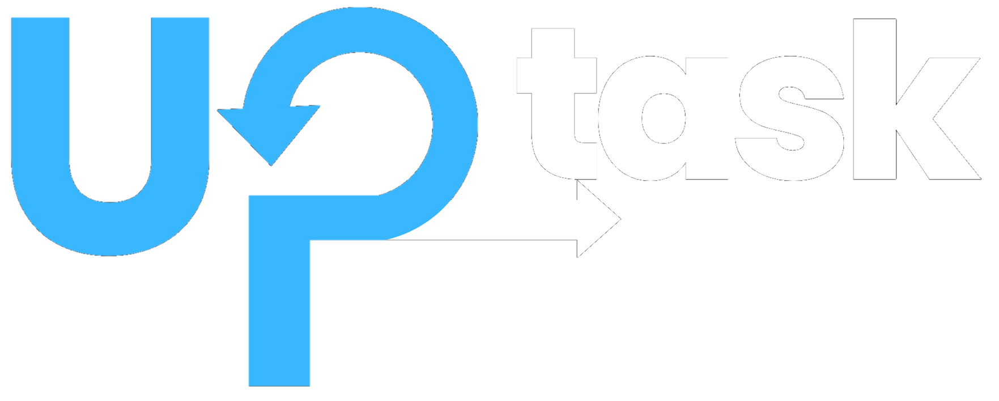

  

<h1 align="center">Hi, I'm Fernando Hernandez 👋</h1>

  <strong>Fullstack Software Engineer | Backend Focused</strong> 
  Passionate about building scalable and maintainable applications with modern technologies.

---

## 🧑‍💻 About Me

I'm a full-stack developer with over 2 years of experience building web applications. My current focus is on backend development with technologies like **Spring Boot**, **NestJS**, and **Node.js**, while also having solid frontend experience with **React**, **Vue.js**, and **TailwindCSS**. I'm constantly learning and growing both personally and professionally.

---

## 🚀 My Tech Stack

### 💻 Languages & Frameworks

### 🗃️ Databases

### ⚙️ Tools & Platforms

### 📦 Others

---

## 🛠️ Full List of Technologies

---

## 📂 Featured Project: UpTask

> Kanban-style task management application.

### 🔗 [Repository](https://github.com/josefer09/UpTask_FullStack) | [Demo](https://uptask-frontend-ten.vercel.app)

  

UpTask is a fullstack project designed as a task board where users can register, invite collaborators, create tasks, and track their progress. Built with **React**, **Tailwind**, **Express**, **MongoDB**, and **TypeScript**.

 & more!

---

## 📚 Other Projects

- 💸 **Expense Planner** – React (ContextAPI, Reducer, Custom Hooks): [Demo](https://66545bc37d713970f949f8c0--rococo-cobbler-315c95.netlify.app) | [Repo](https://github.com/josefer09/expense_planner.git)

- 🐶 **Veterinary Patient Manager** – FullStack MERN: [Repo](https://github.com/josefer09/FullStack_Veterinaria.git)

- 🦷 **Dental Clinic Manager API** – RESTful Backend: [Repo](https://github.com/josefer09/consultorio_dental.git)

- 🧼 **Clean Architecture API** – Node + Clean Pattern: [Repo](https://github.com/josefer09/REST_API_CleanArchitecture.git)

- 🍽️ **Restaurant Menu** – React: [Demo](https://poetic-heliotrope-3fae31.netlify.app/) | [Repo](https://github.com/josefer09/restaurant_menu)

---

## 📫 Contact Me

  
  &nbsp;&nbsp;&nbsp;
  

  I'm always open to <strong>feedback</strong>, <strong>collaboration</strong>, or just a good tech chat! 
  Feel free to reach out via LinkedIn or email. 
  <strong>Email:</strong> <a href="mailto:josefer.hdeza@gmail.com">josefer.hdeza@gmail.com</a>

---

  

